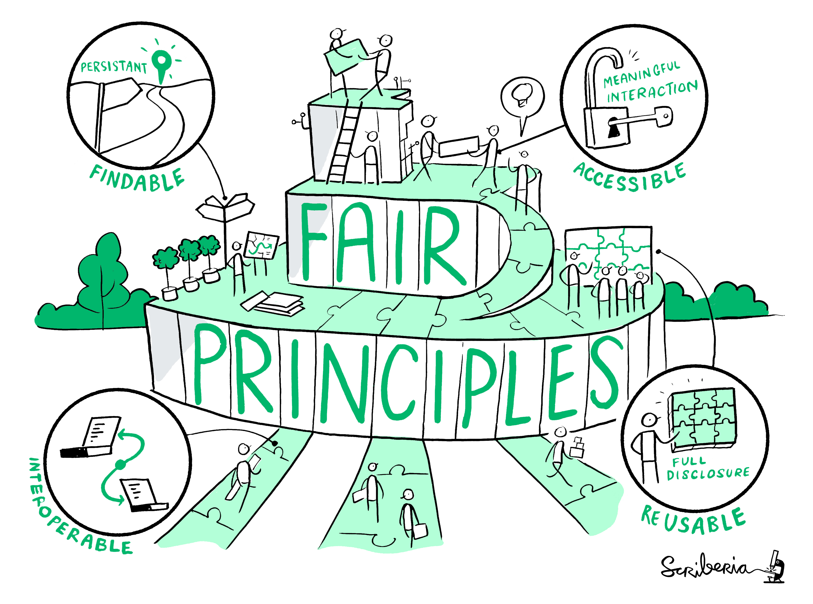
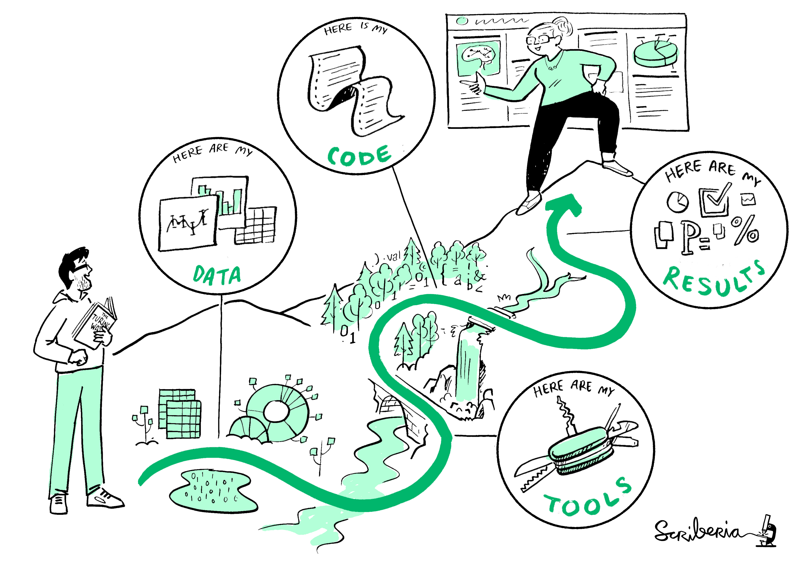

## What is FAIR?

The FAIR principles for research data, originally published in a [2016 Nature
paper](https://doi.org/10.1038/sdata.2016.18), are intended as "a guideline for
those wishing to enhance the reusability of their data holdings." This guideline
has subsequently been endorsed by working groups, funding bodies and
institutions.

FAIR is an acronym for Findable, Accessible, Interoperable, Reusable.

- Findable: others (both human and machines) can discover the data
- Accessible: others can access the data
- Interoperable: the data can easily be used by machines or in data analysis workflows.
- Re-usable: the data can easily be used by others for new research

The FAIR principles have a strong focus on "machine-actionability". This means
that the data should be easily readable by computers (and not only by humans).
This is particularly relevant for working with and discovering new data.

> ## What the FAIR principles are **not**
>
> - A standard: The FAIR principles need to be adapted and followed as much as
>   possible by considering the research practices in your field.
>
> - All or nothing: making a dataset (more) FAIR can be done in small,
>   incremental steps.
>
> - Open data: FAIR data does not necessarily mean openly available. For
>   example, some data cannot be shared openly because of privacy
>   considerations. As a rule of thumb, data should be *"as open as possible, as
>   closed as necessary."*
>
> - Tied to a particular technology or tool. There might be different tools that
>   enable FAIR data within different disciplines or research workflows.
>
{: .callout}

 *This
image was created by Scriberia for The Turing Way community and is used under a
CC-BY licence. Source: <https://doi.org/10.5281/zenodo.3695300>*

> ## Discuss the different principles
>
> Read the summary table of the 15 FAIR principles in [Wilkinson *et
> al.*](https://doi.org/10.1038/sdata.2016.18) (See "Box 2: The FAIR Guiding
> Principles"). After reading this, answer the following questions:
>
> - Are there any terms that you are unfamiliar with
> - Are there any principles that you could implement right away?
> - What do you think would be the most challenging principle to implement?
>
{: .discussion}

## Why FAIR?

The original authors of the FAIR principles had a strong focus on enhancing
reusability of data. This ambition is embedded in a broader view on knowledge
creation and scientific exchange. If research data are easily discoverable and
re-usable, this lowers the barriers to repeat, verify, and build upon previous
work. The authors also state that this vision applies not just to data, but to
all aspects of the research process. This is visualized in the image below.

 *This
image was created by Scriberia for The Turing Way community and is used under a
CC-BY licence. Source: <https://doi.org/10.5281/zenodo.3695300>*

> ## What's in it for you?
>
> FAIR data sounds like a lot of work. Is it worth it? Here are some of the benefits:
>
> - Funder requirements
> - It makes your work more visible
> - Increase the reproducibility of your work
> - If others can use it easily, you will get cited more often
> - You can create more impact if it's easier for others to use your data
> - ...
>
{: .checklist}

## Getting started with FAIR (climate) data

As mentioned above, the FAIR principles are intended as guidelines to increase
the reusability of research data. However, how they are applied in practice
depends very much on the domain and the specific use case at hand.

For the domain of climate sciences, some standards have already been developed
that you can use right away. In fact, you might already be using some of them
without realizing it. NetCDF files, for example, already implement some of the
FAIR principles around data modelling. But sometimes you need to find your own
way.

This tutorial contains six thematic episodes that cover the basic steps to
making data FAIR. We will explain how these topics relate to the FAIR
principles, what you can already do today, and where appropriate, we will point
out existing standards for climate data.

The episodes are:

- Documentation: helps to make data reusable, especially for humans
- Metadata: similar to documentation, although typically more structure and standardized
- Data formats: highly relevant for interoperability and long-term preservation of data
- Data access: data repositories as well as software can greatly increase data access and findability
- Identifiers: very important for reproducibility, but also for data access and findability
- Licences: well chosen licences facilitate re-use and make sure you get the credits you deserve (if you so desire)

> ## Evaluate one of your own datasets
>
> Pick one dataset that you've created or worked with recently, and answer the
> following questions:
>
> - If somebody gets this dataset from you, would they be able to understand
>   the structure and content without asking you?
> - Do you know who has access to this dataset? Could somebody easily have access
>   to this dataset? How?
> - Does this dataset needs a proprietary software to be used?
> - Does this dataset have a persistent identifier or usage licence?
>
{: .challenge}

## Further reading

- Wilkinson et al. (2016) _The FAIR Guiding Principles for scientific data management and stewardship_. doi:[10.1038/sdata.2016.18](https://doi.org/10.1038/sdata.2016.18)
- Mons et al. (2017) _Cloudy, increasingly FAIR; revisiting the FAIR Data guiding principles for the European Open Science Cloud_. doi:[10.3233/ISU-170824](https://doi.org/10.3233/ISU-170824)
- [FORCE11](https://www.force11.org/fairprinciples)
- [GO FAIR initiative](https://www.go-fair.org/fair-principles/)
- [EU H2020 Guidelines on FAIR Data Management](https://ec.europa.eu/research/participants/data/ref/h2020/grants_manual/hi/oa_pilot/h2020-hi-oa-data-mgt_en.pdf)


